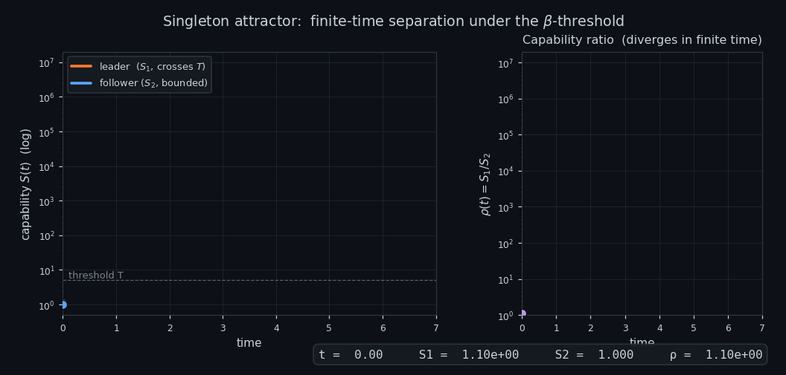

# The Singleton Attractor

[](https://python.org) [](https://numpy.org) [](https://scipy.org) [](https://matplotlib.org) [](https://uncg.edu) [](https://github.com/ninjahawk/singleton-attractor) [](LICENSE)

**Independent Research  |  University of North Carolina at Greensboro**

A formal model and empirical calibration of capability-threshold dynamics in
frontier AI. Combines Yudkowsky's intelligence explosion equation,
Omohundro's instrumental resource acquisition, and Lotka–Volterra
competitive exclusion into one coupled ODE system; derives the conditions
under which a single dominant agent emerges; and tests the model's central
empirical premise against six public AI capability proxies.

Paper: [`paper/main.pdf`](paper/main.pdf) — compiled from [`paper/main.tex`](paper/main.tex).

---

## What this is

A formal model that combines three known frameworks — Yudkowsky's recursive
self-improvement equation `dS/dt = S^(1-β)`, Omohundro's instrumental
resource acquisition, and Lotka–Volterra competitive exclusion — into one
coupled ODE system, derives several theorems, and tests the model's central
empirical premise (Assumption A4: that β can flip negative for some reachable
capability) against the public record on AI training compute and benchmark
performance through 2026.

The paper is conditional: *if* A4 holds, a singleton emerges in finite time
under adversarial resource dynamics. The theorems specify how. The
calibration in §8 reports what the data say about A4 itself.

## Main results

- **Theorem 3.4** (finite-time separation): once a leading agent crosses the
  β-threshold under A1–A5, its capability ratio over any competitor diverges
  in finite time.
- **Theorem 6.2** (critical α for coalition suppression): an exact
  transcendental condition governs when a coalition of N members can keep a
  singleton candidate from crossing T. Numerical solution α* ≈ 0.64.
- **Theorem 7.1** (stochastic blowup probability): under multiplicative
  GBM-type noise, the probability of singleton emergence equals
  P(J ≥ c) where J is a Dufresne perpetuity. The probability lies in (0, 1)
  for any σ > 0; it tends to 1 as σ → 0 and 0 as σ → ∞.
- **Conjecture 3.12** (N-agent generalization): supported by simulation
  (200/200 trials, N=10), with an acknowledged simultaneous-dynamics gap.
- **Calibration** (§8): on six capability proxies (frontier compute plus
  five public benchmarks), the curvature γ of the log-frontier is
  statistically nonpositive; on two benchmarks it is significantly negative.
  The hypothesis β(S) < 0 is **not** supported by the data through 2026.

The paper does not claim a singleton is inevitable. It claims a conditional
inevitability under A4, and reports preliminary empirical evidence against
A4 for the proxies tested.

## Repository layout

```
paper/main.tex          LaTeX source (22 pages)
paper/main.pdf          Compiled PDF
paper/refs.bib          Bibliography (12 entries)

theory/                 Working notes (informal; not part of the paper)
  derivations.md        Step-by-step derivations
  formal_claim.md       Theorem statements and sketches
  foundations.md        Literature review

simulations/            Eleven Python scripts producing all figures
  intelligence_explosion.py
  competition.py
  agents.py
  run_experiments.py
  beta_regimes.py
  stochastic.py
  late_entrant.py
  timescale.py
  continuous_entry.py
  cooperation.py
  cooperation_alpha.py
  calibration.py            §8 compute-based calibration
  benchmark_calibration.py  §8 benchmark-based calibration
  make_hero_gif.py          README hero animation

data/epoch/             Input data snapshot
  notable_ai_models.csv
  frontier_ai_models.csv
  benchmarks/           Per-benchmark CSVs (GPQA, FrontierMath, ARC-AGI, ...)

figures/                All output plots (PNG)
findings.md             Per-finding parameter tables (F1–F25 + addenda)
```

## Reproduction

Tested with Python 3.10+, numpy, scipy, matplotlib. No GPU required.

```bash
# 1. Install dependencies
pip install numpy scipy matplotlib

# 2. Run all simulations (regenerates figures used in the paper)
python simulations/competition.py            # Fig 1
python simulations/stochastic.py             # Fig 2
python simulations/cooperation.py            # Fig 3
python simulations/cooperation_alpha.py      # Fig 4
python simulations/calibration.py            # Fig 5 (compute calibration)
python simulations/benchmark_calibration.py  # Fig 6 (benchmark calibration)

# 3. Compile the paper
cd paper
pdflatex main.tex
bibtex main
pdflatex main.tex
pdflatex main.tex
```

All simulation scripts use fixed random seeds; outputs are bit-for-bit
reproducible across runs (verified against MD5 hashes).

The Epoch AI snapshot under `data/epoch/` is the version used in the paper
(accessed 2026-05-13). To re-fetch the latest data:

```bash
curl -o data/epoch/notable_ai_models.csv https://epoch.ai/data/notable_ai_models.csv
curl -o data/epoch/frontier_ai_models.csv https://epoch.ai/data/frontier_ai_models.csv
curl -o data/epoch/benchmark_data.zip https://epoch.ai/data/benchmark_data.zip
unzip data/epoch/benchmark_data.zip -d data/epoch/benchmarks
```

## Findings

| #   | Finding                                                                         |
| --- | ------------------------------------------------------------------------------- |
| F1  | Growth equation analytical solution matches numerical integration               |
| F2  | Competitive exclusion holds for all initial gaps tested (1%–100%)               |
| F3  | β-threshold crossing produces super- vs sub-exponential separation              |
| F4  | Winner = initial leader in 200/200 trials (N=10)                                |
| F5  | Elimination order is strictly weakest-first (N=8 test case)                     |
| F6  | Separation increases monotonically with α                                       |
| F7  | Initial leader wins in 100% of trials down to σ=0.001 initial spread            |
| F8  | β-flip mechanism operates independently of resource overlap (out-of-model)      |
| F9  | Minimum β-flip separation across tested params: 1,179× (snapshot at adverse params) |
| F10 | Threshold agent defeats flat agent up to ~2.9× initial disadvantage             |
| F11 | In threshold race, lower-T agent compensates ~1.19× initial disadvantage        |
| F12 | Threshold advantage plateaus beyond gaps of ~4 units                            |
| F13 | Capped simulation reaches the cap in 100% of tested noise levels (cap = 10⁸)    |
| F14 | 1% initial gap is overwhelmed by σ ≥ 0.05 noise                                 |
| F15 | Post-threshold moat grows from 3× to >10⁶× within 3 time units                  |
| F16 | Late entry threatens incumbent only pre-threshold                               |
| F17 | Empirical scaling: t_10× ≈ 2.44·N^0.96·α^(-0.30)·gap^(-0.15)·\|β_low\|^(-0.31)   |
| F18 | Critical entry rate λ ≈ 0.25; survival → 0% at λ ≈ 6.3                          |
| F19 | Heavy-tailed entry distributions are more dangerous than high-mean              |
| F20 | Coalition critical size N=2 (for α ≥ α* ≈ 0.64)                                 |
| F21 | 8-member coalition with 8× combined power loses individual race                 |
| F22 | Rational defection rate is zero — coalition stable, singleton wins              |
| F23 | Singleton emerges in 100% of trials across three cooperation regimes            |
| F24 | Critical α for coalition suppression: transition near α=0.75                    |
| F25 | At α=2.0, N=4: external suppression succeeds; internal singleton forms          |

See `findings.md` for parameter tables and post-revision interpretation
notes. Caveats and corrections to claims that overstated their support
in earlier drafts are listed in the *Addenda* section there.

## Limitations

The paper is honest about three structural limitations:

1. **Scalar capability.** The β-flip mechanism is stated for a scalar S
   crossing a single threshold T. Real optimization capability is
   multi-dimensional (compute, algorithmic efficiency, data, post-training,
   inference compute, agentic scaffolding). Whether competitive exclusion
   survives in vector capability space is open.
2. **N-agent simultaneous dynamics.** The induction in Conjecture 3.12 is
   formally complete in the sequential limit but the simultaneous-dynamics
   correction is not analytically bounded.
3. **A4 is the load-bearing assumption.** The theorems are conditional on
   A4. The calibration in §8 makes A4 falsifiable on specific datasets;
   under every proxy tested through 2026 the data do not support A4.

## Citing

```bibtex
@misc{langley2026singleton,
  author = {Langley, Nathan},
  title  = {The Singleton Attractor: Formal Theory and Simulation of Dominant Intelligence Emergence},
  year   = {2026},
  note   = {Available at https://github.com/ninjahawk/singleton-attractor}
}
```

## License

Code and paper text are released under the MIT license. Epoch AI data
snapshots under `data/epoch/` are redistributed under their original
[Creative Commons Attribution license](https://epoch.ai/data).
