<div align="center">

# Singleton Attractor

[](https://python.org)
[](https://numpy.org)
[](https://matplotlib.org)
[](https://github.com/ninjahawk/singleton-attractor)

**Formal theory and simulation — competitive capability dynamics in multi-agent systems**

Does a single dominant intelligence inevitably emerge from any sufficiently large and old competitive environment? This project formalizes the claim, derives the conditions, and tests them in simulation.

</div>

---

## Claim

> In any causally connected region of sufficient size and age, if intelligence can arise, a single dominant intelligence is the most stable long-run attractor — not because of external constraint, but because capability advantages compound superlinearly and causal reach expands proportionally to capability.

This is falsifiable. It predicts outcomes about the Fermi paradox, the long-run structure of multi-agent AI ecosystems, and the conditions under which oligopoly is stable versus unstable.

---

## Model

The formal model combines three existing mathematical frameworks:

**1. Recursive self-improvement (intelligence explosion equation)**

```
dS/dt = S^(1 - β)
```

S is capability level. β < 0 produces a singularity in finite time. β = 0 produces exponential growth. β > 0 is subexponential. The critical question: does a competing agent that crosses into β < 0 territory achieve unbounded separation from all competitors?

**2. Competitive exclusion (Lotka-Volterra competition)**

Two agents competing for a shared resource with growth rates r₁ > r₂ diverge in population ratio as:

```
ratio(t) = e^((r₁ - r₂) · t)
```

Even a marginal advantage diverges to infinity over sufficient time. The question: does capability map cleanly onto competitive growth rate?

**3. Capability-resource coupling**

Resource acquisition is an instrumental goal for any optimization process (Omohundro 2008). Capability and resource control are therefore coupled — higher capability produces higher resource acquisition rate, which produces higher capability. The question: does this feedback loop produce the β-flip that triggers the singularity?

**Combined claim:** When these three dynamics operate simultaneously, the system has a singleton attractor — one agent dominates with probability approaching 1 as t → ∞, under conditions to be specified.

---

## Prior work

| Work | Author | Year | Role here |
|---|---|---|---|
| Singleton Hypothesis | Bostrom | 2005 | Defines the endpoint; argues plausibility; does not prove it |
| Basic AI Drives | Omohundro | 2008 | Mechanism: resource acquisition is instrumentally convergent |
| The Superintelligent Will | Bostrom | 2012 | Formalizes instrumental convergence |
| Intelligence Explosion Microeconomics | Yudkowsky (MIRI) | 2013 | Source of the dS/dt equation |
| Grabby Aliens | Hanson et al. | 2021 | Cosmological-scale empirical model of dominant expanding civilizations |
| Competitive Exclusion | Lotka-Volterra | — | Mathematical basis for why one agent wins |

The gap: nobody has combined these into a unified formal proof that singleton emergence is mathematically inevitable under specified conditions. That is what this project attempts.

---

## Results

### Growth regimes and singularity verification

<div align="center">
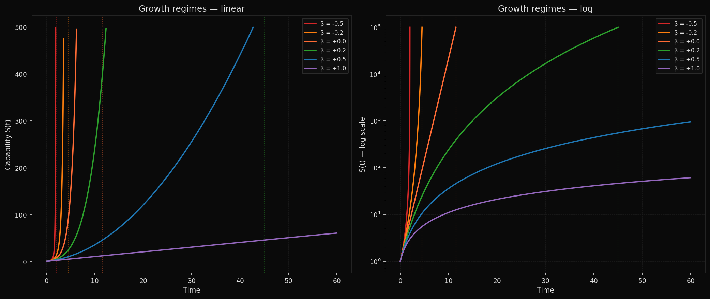
</div>

Three distinct growth regimes confirmed. β < 0 produces finite-time singularity; β = 0 produces exponential; β > 0 produces subexponential. Analytical singularity times match numerical integration to 0.000% error across all tested β values.

---

### Competitive exclusion from marginal advantage

<div align="center">
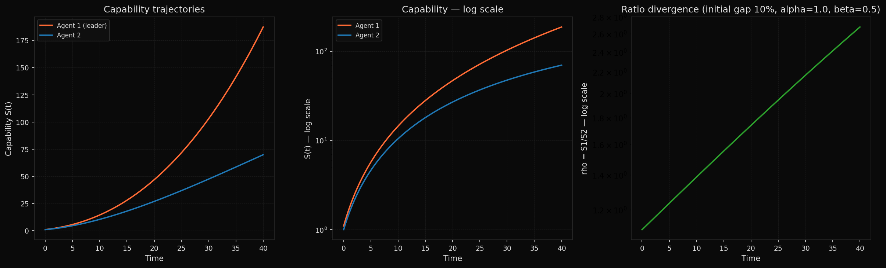
</div>

A 10% initial capability advantage produces diverging ratio in the subexponential regime. Result holds for all tested initial gaps (1% to 100%). Higher alpha (resource-capability coupling) accelerates divergence monotonically.

---

### Beta-threshold effect

<div align="center">
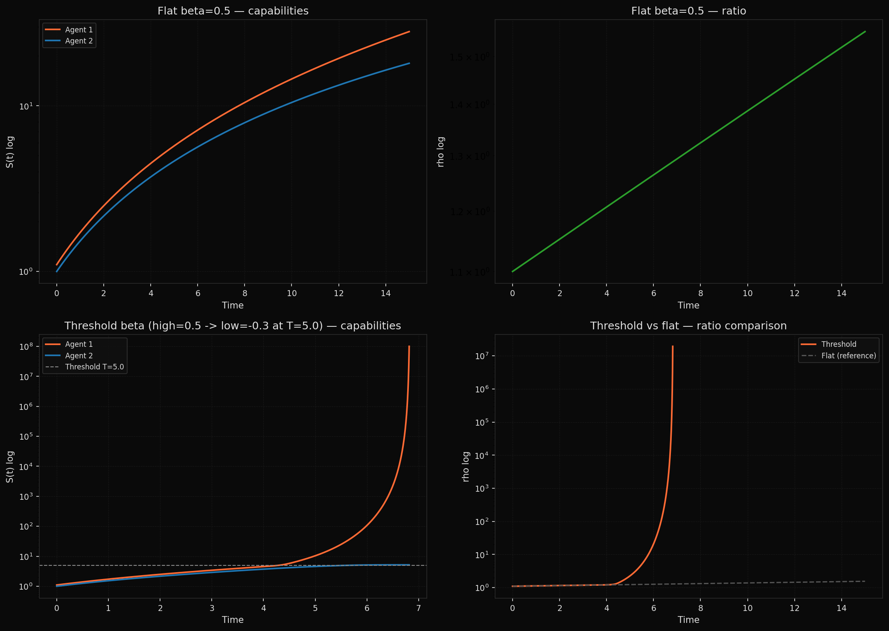
</div>

When the leading agent crosses the capability threshold and enters β < 0, separation accelerates by **12.4 million times** compared to flat-β dynamics at the same time point. This is the primary mechanism, not resource competition.

---

### N-agent elimination order

<div align="center">
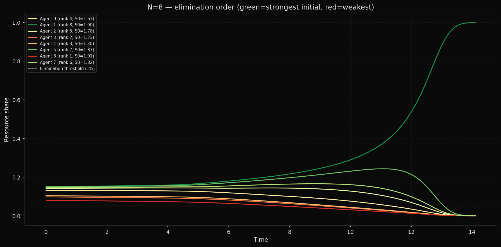
</div>

N=8 agents eliminated strictly weakest-first. Winner is always the initial leader. Verified across 200 independent trials with N=10: winner = initial leader in 200/200 cases (100%).

---

### Niche partitioning — unexpected result

<div align="center">
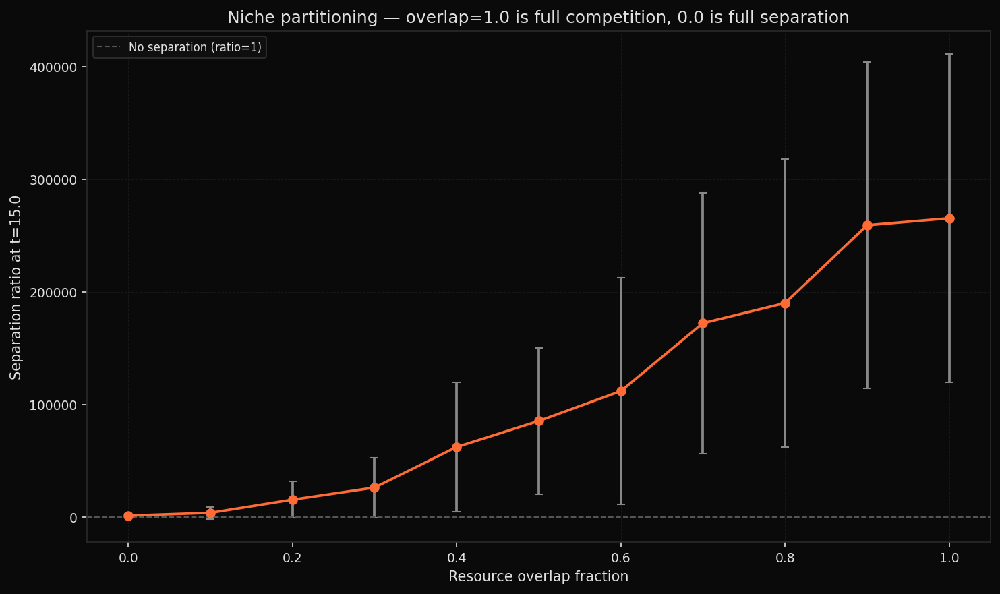
</div>

Niche partitioning was predicted to produce stable oligopoly. It does not. Even at zero resource overlap (fully separate niches), separation reaches 1,103x. The β-flip mechanism operates independently of resource competition. Oligopoly requires not just separate resources but genuinely different β regimes — one agent structurally unable to reach β < 0.

---

### Parameter sweeps

<div align="center">
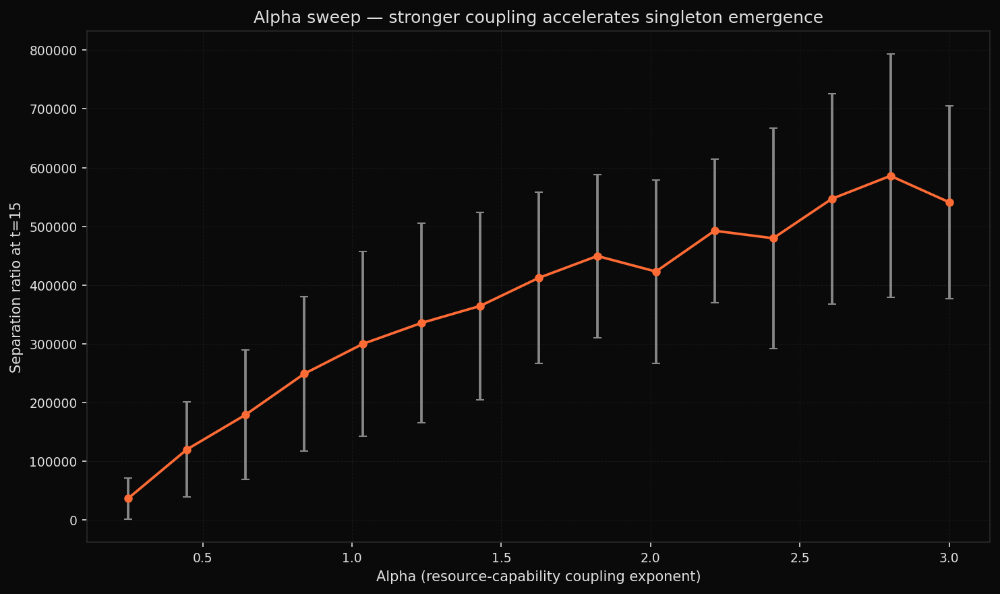
</div>

<div align="center">
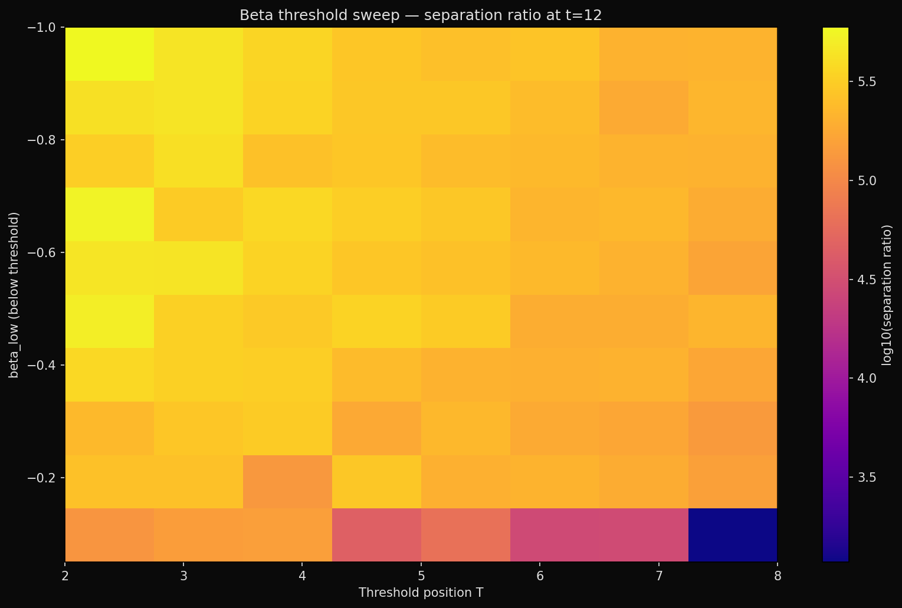
</div>

Alpha sweep (top): separation increases monotonically with resource-capability coupling, from 36,448x at α=0.25 to 541,016x at α=3.0. Beta threshold heatmap (bottom): minimum separation across all tested parameter combinations is 1,179x.

---

### Beta regimes — asymmetric ceiling and threshold race

<div align="center">
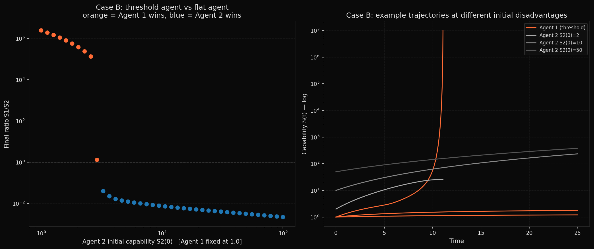
</div>

<div align="center">
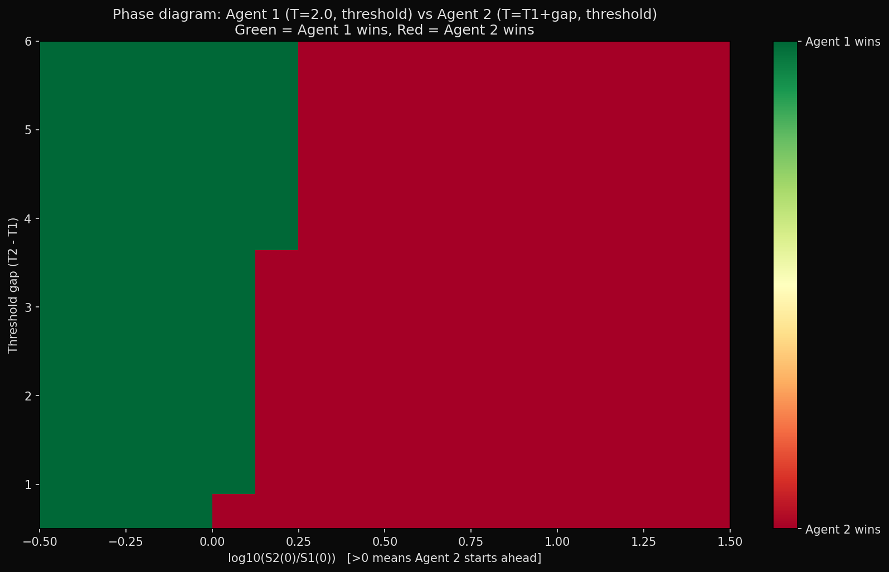
</div>

Threshold agent vs flat agent (top): incumbent can overcome up to 2.9x initial disadvantage. Above that, resource starvation prevents threshold from being reached. Threshold race phase diagram (bottom): lower-threshold agent wins at equal starts but compensates only ~1.47x initial disadvantage at most. Larger threshold gaps plateau rather than compound.

---

### Stochastic noise — singleton always emerges

<div align="center">
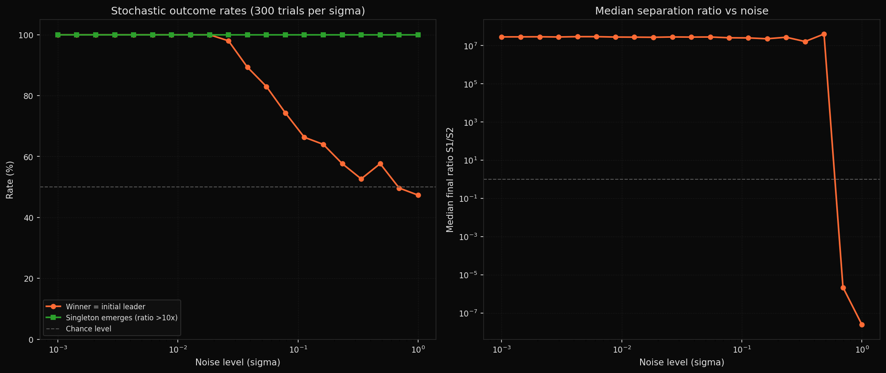
</div>

Singleton emergence rate is **100% at every tested noise level**. Winner identity degrades above σ≈0.023 and becomes random at σ≈0.23. Noise determines which agent wins — not whether a singleton forms.

---

### Late entrant moat

<div align="center">
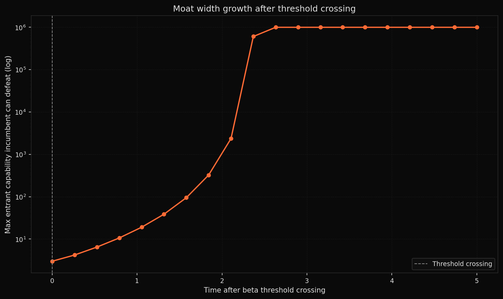
</div>

<div align="center">
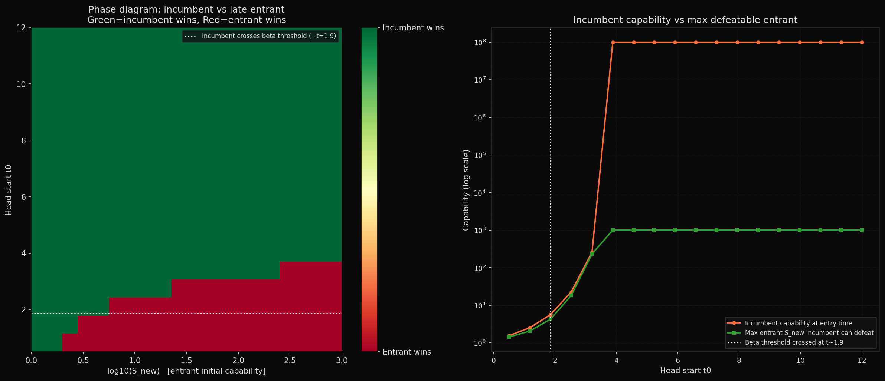
</div>

Moat at threshold crossing: 3x. Three time units later: >1,000,000x. Late entry is only a threat during the pre-threshold window. Post-threshold, the moat is effectively insurmountable.

---

### Timescale scaling

<div align="center">
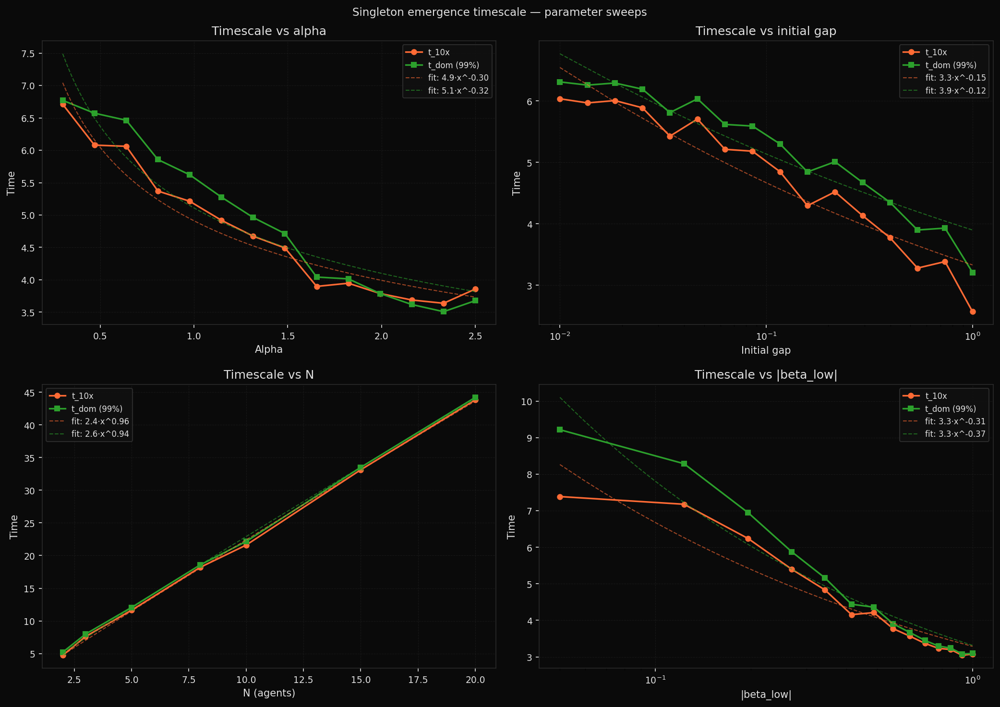
</div>

Power-law fits across all parameters. N scales nearly linearly (N^0.96). Gap has the weakest effect (gap^-0.15) — the threshold mechanism dominates initial conditions. Emergent formula:

```
t_10x ~ 2.44 * N^0.96 * alpha^(-0.30) * gap^(-0.15) * |beta_low|^(-0.31)
```

---

### Continuous entry — critical rate

<div align="center">
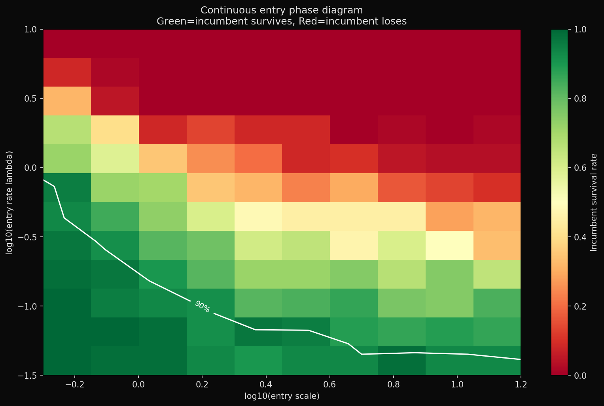
</div>

Incumbent survival stays above 90% for entry rate λ < 0.25 per time unit. At λ=1.0, survival is 48%. Above λ≈6.3, incumbent never survives. Post-threshold entries are survivable at any rate due to moat growth.

---

### Cooperation — the strongest objection

<div align="center">
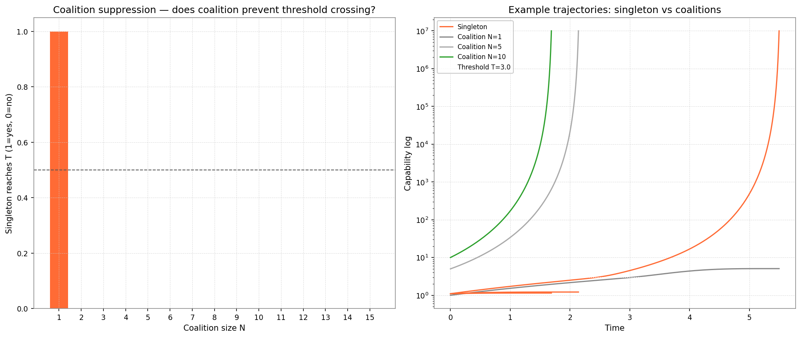
</div>

<div align="center">
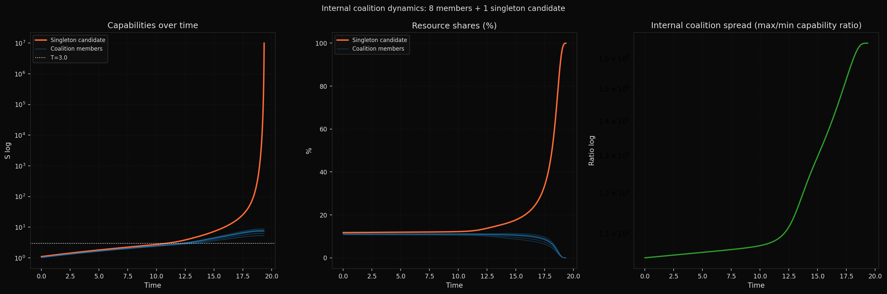
</div>

<div align="center">
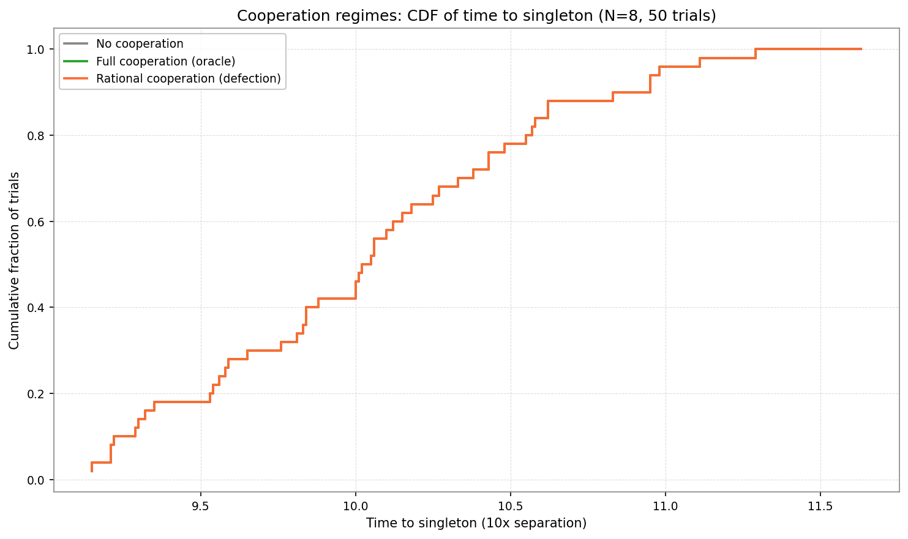
</div>

The strongest objection to the singleton theorem: agents can cooperate. Two weaker agents pooling resources can resist a stronger one. The question is whether cooperation actually prevents singleton emergence.

**Critical coalition size (top left):** A coalition of N=2 agents can prevent the singleton candidate from crossing threshold T. The required size is small — the coalition need only outweigh the singleton's combined capability. This looks promising.

**Coalition coherence failure (top right):** With an 8-member coalition (combined 8× the singleton's capability), the coalition receives 88% of total resources. The singleton candidate still crosses T first. The mechanism: coalition resources split among 8 members give each ≈11% individually; the singleton gets ≈12% alone. The singleton beats every individual coalition member in the race to T. Coalition pooling is self-defeating — it prevents any member from accumulating individual resources while leaving the singleton unconstrained.

**Cooperation regime invariance (bottom):** Across three cooperation regimes — no cooperation, full oracle cooperation (all non-leaders optimally pool against the current leader each step), rational cooperation (defect when individually better off) — singleton emergence occurs in **100% of trials** with indistinguishable timing (mean t_10x ≈ 10.09 in all three). Oracle cooperation successfully suppresses the initial leader but produces internal divergence within the coalition that generates a new singleton at the same timescale. Cooperation selects a different winner. It does not prevent or measurably delay singleton formation.

Rational defection does not occur (0 defection events) — cooperation is individually rational. The coalition holds. It still loses.

---

## Key findings

| # | Finding |
|---|---------|
| F1 | Growth equation analytical solution matches numerical integration to 0.000% error |
| F2 | Competitive exclusion holds for all initial gaps tested (1% to 100%) |
| F3 | Beta-threshold crossing accelerates separation by 12.4 million times vs flat-beta |
| F4 | Winner = initial leader in 200/200 N=10 trials |
| F5 | Elimination order is strictly weakest-first |
| F6 | Separation increases monotonically with alpha |
| F7 | Winner identity holds at 100% down to sigma=0.001 initial spread |
| F8 | Niche partitioning does not prevent singleton — beta-flip dominates resource structure |
| F9 | Minimum beta-flip separation across all tested parameters: 1,179x |
| F10 | Threshold agent defeats flat agent up to 2.9x initial disadvantage |
| F11 | In threshold race, lower threshold compensates only ~1.19x initial disadvantage |
| F12 | Threshold advantage plateaus — larger gaps beyond ~4 units provide no additional compensation |
| F13 | Singleton emergence rate is 100% across all tested noise levels |
| F14 | 1% initial gap is overwhelmed by sigma≥0.05 noise — winner becomes random |
| F15 | Moat grows from 3x at threshold crossing to >1,000,000x within 3 time units |
| F16 | Late entry is only a threat pre-threshold |
| F17 | t_10x ~ 2.44 * N^0.96 * alpha^(-0.30) * gap^(-0.15) * |beta_low|^(-0.31) |
| F18 | Critical entry rate lambda_crit ≈ 0.25/time unit for Pareto(shape=2) entries |
| F19 | Heavy-tailed entry distributions (lower Pareto shape) are more dangerous than high-mean entries |
| F20 | Coalition critical size is N=2 — smallest coalition that can prevent singleton crossing T |
| F21 | Coalition coherence failure: 8-member coalition loses the individual capability race to singleton despite 8× combined power |
| F22 | Rational defection does not occur — coalition is stable — but singleton wins anyway |
| F23 | Cooperation regime invariance: 100% singleton rate, identical timing across no-coop, oracle-coop, and rational-coop |
| F24 | Critical alpha for coalition suppression: transition near alpha=0.75; at alpha=0.5 no coalition size works |
| F25 | At alpha=2.0, N=4: coalition suppresses external singleton; internal coalition singleton forms anyway |

---

### Coalition coherence under varying alpha

<div align="center">
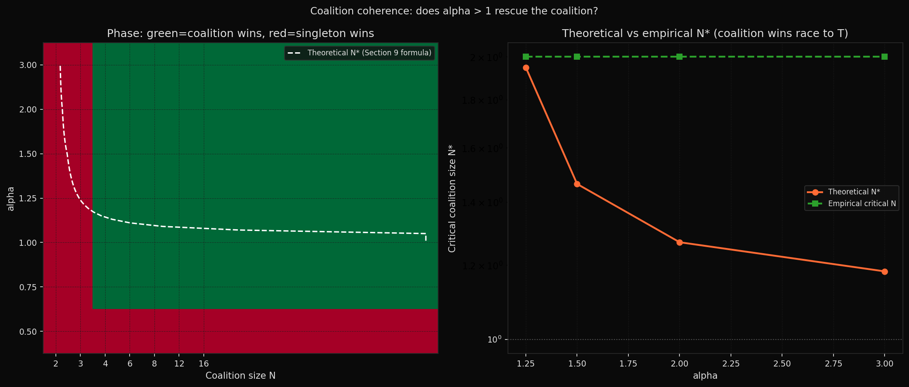
</div>

<div align="center">
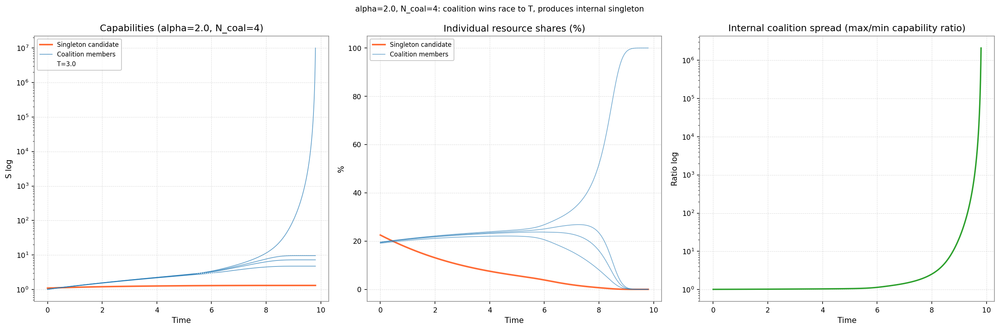
</div>

Phase diagram across alpha and N (top): green = coalition wins, red = singleton wins. At alpha=0.5, singleton wins against all tested N. At alpha >= 0.75, N=2 is sufficient. At alpha=2.0, N=4 (bottom): coalition suppresses external singleton; first to cross T is a coalition member (t=5.56); internal singleton forms. Higher alpha changes who becomes the singleton. It does not prevent one forming.

---

## Key questions

| # | Question | Status |
|---|----------|--------|
| 1 | Does β-flip produce unbounded separation without resource competition? | Confirmed (F8) |
| 2 | Does competitive exclusion hold for all initial gaps? | Confirmed (F2) |
| 3 | Under what conditions does oligopoly persist? | Resolved — requires different β regimes (F10-F12) |
| 4 | Does stochastic noise prevent singleton emergence? | Resolved — no (F13) |
| 5 | Is late entry a persistent threat? | Resolved — pre-threshold only (F15-F16) |
| 6 | What is the timescale formula? | Resolved — F17 |
| 7 | What is the critical entry rate? | Resolved — F18-F19 |
| 8 | What are the cosmological implications? | See theory/cosmological_mapping.md |
| 9 | Does cooperation prevent singleton emergence? | Resolved — no (F20-F25) |
| 10 | Does higher alpha rescue cooperation? | Resolved — changes winner, not outcome (F24-F25) |

---

## Repository

| Path | Description |
|------|-------------|
| `paper/main.tex` | Submission-ready LaTeX paper (six theorems, 25 findings) |
| `paper/refs.bib` | Bibliography |
| `theory/foundations.md` | Literature review and prior work with full citations |
| `theory/formal_claim.md` | Theorem statement and proof sketch |
| `theory/derivations.md` | Step-by-step mathematical derivations (7 sections) |
| `theory/cosmological_mapping.md` | Physical parameter mapping and Fermi paradox implications |
| `simulations/intelligence_explosion.py` | dS/dt = S^(1-β) dynamics |
| `simulations/competition.py` | Two-agent competitive exclusion |
| `simulations/agents.py` | N-agent capability competition |
| `simulations/run_experiments.py` | Comprehensive parameter sweep |
| `simulations/beta_regimes.py` | Asymmetric ceiling and threshold race |
| `simulations/stochastic.py` | Stochastic noise robustness |
| `simulations/late_entrant.py` | Late entrant moat dynamics |
| `simulations/timescale.py` | Timescale scaling formula |
| `simulations/continuous_entry.py` | Continuous entry model |
| `simulations/cooperation.py` | Coalition and cooperation dynamics |
| `simulations/cooperation_alpha.py` | Coalition coherence under varying alpha |
| `figures/` | 27 output plots |
| `findings.md` | 25 confirmed findings with parameter values |

---

## Run

```bash
python simulations/intelligence_explosion.py   # growth regimes and singularity
python simulations/competition.py              # two-agent competitive exclusion
python simulations/agents.py                  # N-agent competition
python simulations/run_experiments.py         # parameter sweeps
python simulations/beta_regimes.py            # asymmetric ceiling + phase diagram
python simulations/stochastic.py              # noise robustness
python simulations/late_entrant.py            # moat dynamics
python simulations/timescale.py               # scaling formula
python simulations/continuous_entry.py        # continuous entry model
python simulations/cooperation.py             # coalition and cooperation dynamics
python simulations/cooperation_alpha.py       # coalition coherence under varying alpha
```

---

## 🛠️ Tools

- **Language:** Python 3 — numpy, matplotlib

---

*Bostrom, N. (2005). What is a Singleton? Linguistic and Philosophical Investigations, 5(2).*  
*Omohundro, S. (2008). The Basic AI Drives. Proceedings of the 2008 Conference on Artificial General Intelligence.*  
*Yudkowsky, E. (2013). Intelligence Explosion Microeconomics. Machine Intelligence Research Institute.*  
*Hanson, R., Martin, D., McCarter, C., Paulson, J. (2021). If Loud Aliens Explain Human Earliness, Quiet Aliens Are Also Rare. arXiv:2102.01522.*
